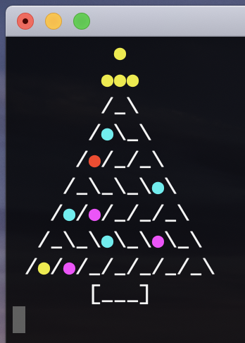
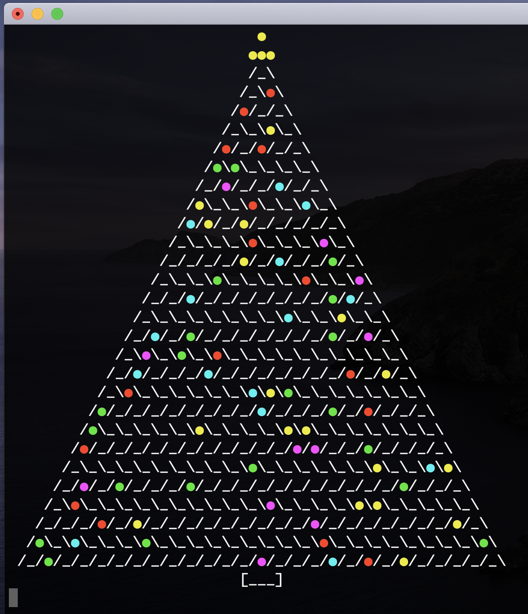
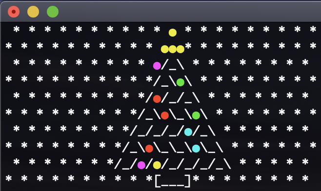
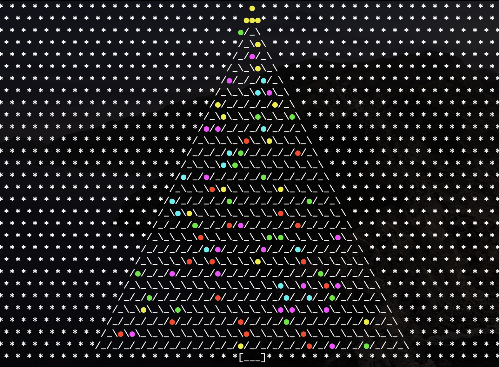

# Generate a animated christmast tree
Generate a christmast tree with animated lightbulbs in terminal!  
  
## Usage
`python3 tree.py <height-of-tree> --snow`  

`--snow`-flag is optional only if you want to display snow.  

**_Example_**

`python3 tree.py 10`  

`python3 tree.py 30`  

`python3 tree.py 10 --snow`  

`python3 tree.py 30 --snow`  

## System
* MacOS Catalina
* Python 3.6.4